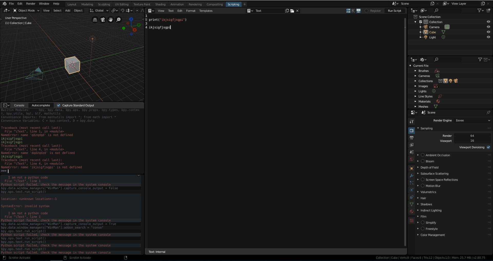

## Table of contents
* [General info](#general-info)
* [Technologies](#technologies)
* [Features](#features)
* [Screenshots](#screenshots)
* [Setup](#setup)

## General info
 Enable logging in python console window

## Technologies
Project is created with:
* Python
For
* Blender 2.80 
* Blender 2.79

## Features
* The loggin is enabled by default 
* Log error and print
* Support Blender 2.79 and 2.80  

if you want to temporary disable it you can uncheck a combo box in the top of python console window.

## Screenshots  



## Setup
```
Download zip file install it directly from your blender
```


## Good developing.
